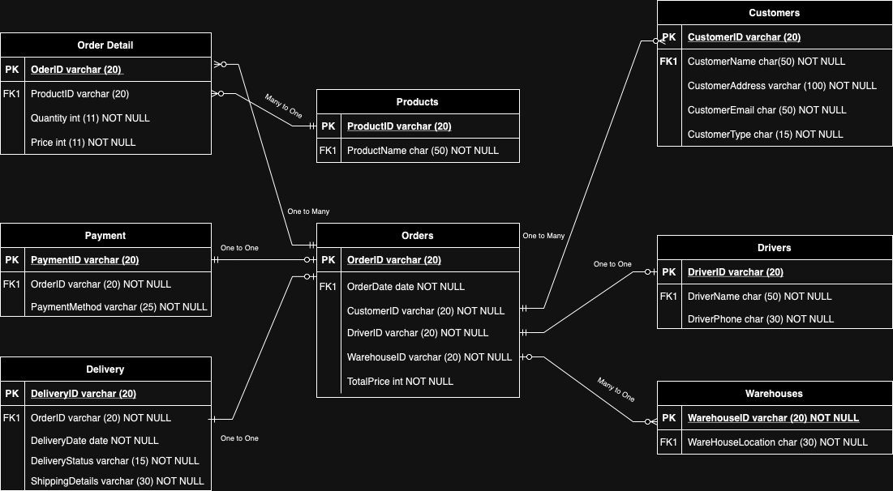

# Database Technology Project: Supply Chain and Distribution Analysis

This project focuses on designing and implementing a structured database to analyze the supply chain and distribution of key agricultural products such as coffee, rice, and corn. The goal is to provide a solid foundation for understanding demand patterns and optimizing logistical efficiency.

---

## 🎯 Project Objectives

1.  **Analyze Demand Dynamics:** Identify patterns in food product orders based on time, product type, location, and delivery status.
2.  **Improve Distribution:** Use data analysis to ensure a more effective and targeted product distribution process.
3.  **Organize Data:** Systematically collect and present order data for coffee, rice, and corn to support detailed analysis.

---

## 🛠️ Database Design and Methodology

### Data Anomalies and Normalization

The database was designed to prevent common data anomalies (Insert, Update, and Delete) by applying **normalization up to the Third Normal Form (3NF)**. This process involved breaking down the initial data into separate, logical tables to eliminate redundancy and maintain data integrity.

* **Insert Anomaly:** Prevented by ensuring that new customer or product data can be added without being tied to an order.
* **Update Anomaly:** Eliminated by separating entities like customers and drivers into their own tables, so a change to one record doesn't require updating multiple rows in different tables.
* **Delete Anomaly:** Avoided by storing independent data (like customer or warehouse information) in separate tables, preventing its accidental deletion when an order is removed.

### Functional Dependencies

The normalized design enforces key functional dependencies to ensure data consistency:

* `OrderID` → `CustomerID`, `OrderDate`
* `CustomerID` → `CustomerName`, `CustomerAddress`, `CustomerEmail`
* `ProductID` → `ProductName`
* `WarehouseID` → `WarehouseLocation`
* `DriverID` → `DriverName`, `DriverPhone`

### Entity-Relationship Diagram (ERD)

The database schema consists of eight main entities with clear relationships:

* **Orders:** Core information about each order.
* **Order Detail:** Specific details of each product within an order.
* **Payment:** Payment information for each order.
* **Delivery:** Delivery status and details.
* **Products:** Product information.
* **Customers:** Customer details.
* **Drivers:** Driver information.
* **Warehouses:** Warehouse locations.

The relationships between these entities are designed to be either One-to-One or Many-to-One to maintain a clean and efficient structure.

## 📈 Evaluation and Future Improvements

The current dataset provides a strong foundation for basic analysis, as demonstrated by visualizations showing total sales per product and delivery status per warehouse.

However, to gain deeper insights, future improvements are needed:

* **Expand the Dataset:** Add more historical data to better identify seasonal and long-term trends.
* **Enrich Data Points:** Include new information such as shipping costs, discounts, and customer reviews to enable more comprehensive analysis of profitability and customer satisfaction.
